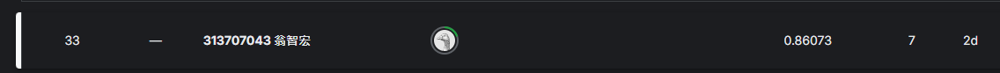

# 智能所-Machine Learning Lab2-辛普森角色 CNN模型辨識
## Author：國立陽明交通大學 資訊管理與財務金融學系財務金融所碩一 313707043 翁智宏

本次是機器學習第二次作業，訓練一個影像辨識模型，能夠辨識出 *The Simpsons* 動畫影集中 **50 位角色**。我們採用 **卷積神經網路 (Convolutional Neural Network, CNN)** 作為模型基礎，進行角色的影像辨識。

Kaggle Competition：[點擊這裡](https://www.kaggle.com/competitions/nycu-iaii-ml-2024-classification) 競賽連結

最終成績如下所示：



> 準確率在 0.86073 左右
---

## 目標角色 (Target Characters)

以下是數據集中包含的角色：

- abraham_grampa_simpson （阿伯拉罕·辛普森爺爺）  
- agnes_skinner （艾格尼斯·斯金納）  
- apu_nahasapeemapetilon （阿普）  
- barney_gumble （巴尼·岡博）  
- bart_simpson （巴特·辛普森）  
- brandine_spuckler （布蘭丁·斯帕克勒）  
- carl_carlson （卡爾·卡爾森）  
- charles_montgomery_burns （蒙哥馬利·伯恩斯先生）  
- chief_wiggum （維格姆警長）  
- cletus_spuckler （克萊圖斯·斯帕克勒）  
- comic_book_guy （漫畫書店老闆）  
- disco_stu （迪斯可·史都）  
- dolph_starbeam （道夫·斯塔比姆）  
- duff_man （達夫啤酒人）  
- edna_krabappel （艾德娜·克拉巴佩爾老師）  
- fat_tony （胖東尼）  
- gary_chalmers （加里·查莫斯）  
- gil （吉爾）  
- groundskeeper_willie （威利園丁）  
- homer_simpson （霍默·辛普森）  
...  
（其餘角色請參考完整清單）

---

## Images of 50 characters extracted from The Simpsons epsodes
- About 2000 images per character
- Pictures are under various size, scenes and distortions
- not necessarily centered in each image and could sometimes be with or cropped from other characters

---

## 安裝依賴

請使用以下指令安裝本專案所需的依賴套件：

```bash
!pip install torch 
!pip install torchvision   
!pip install timm
!pip install pandas
!pip install matplotlib
```

---
## 實作

### 第一步：資料預處理
#### 1. 先定義資料增強的方法
```
from torchvision.datasets import ImageFolder
from torch.utils.data import random_split, DataLoader
from torchvision import transforms

# 定義資料增強 (Transform)
train_transforms = transforms.Compose([
    transforms.RandomResizedCrop(224),         # 隨機裁剪並調整為 224x224
    transforms.RandomHorizontalFlip(),         # 隨機水平翻轉
    transforms.RandomRotation(15),             # 隨機旋轉 ±15 度
    transforms.ColorJitter(0.1, 0.1, 0.1, 0.1),# 顏色抖動
    transforms.ToTensor(),
    transforms.Normalize([0.485, 0.456, 0.406],
                         [0.229, 0.224, 0.225]) # 標準化
])

valid_transforms = transforms.Compose([
    transforms.Resize(256),
    transforms.CenterCrop(224),                # 中心裁剪為 224x224
    transforms.ToTensor(),
    transforms.Normalize([0.485, 0.456, 0.406],
                         [0.229, 0.224, 0.225]) # 標準化
])
```

#### 2. 載入數據集，以及區隔出訓練集和驗證集
```
# 載入訓練資料集
full_dataset = ImageFolder('train/', transform=train_transforms)

# 按 80% 作為訓練集，20% 作為驗證集
train_size = int(0.8 * len(full_dataset))
valid_size = len(full_dataset) - train_size
train_dataset, valid_dataset = random_split(full_dataset, [train_size, valid_size])

# 修改驗證集的 Transform
valid_dataset.dataset.transform = valid_transforms

# 創建 DataLoader
train_loader = DataLoader(train_dataset, batch_size=32, shuffle=True, num_workers=4)
valid_loader = DataLoader(valid_dataset, batch_size=32, shuffle=False, num_workers=4)
```

#### 3. 設定測試集中的資料轉換部分
```
# 測試資料變換
test_transforms = transforms.Compose([
    transforms.Resize(256),
    transforms.CenterCrop(224),
    transforms.ToTensor(),
    transforms.Normalize([0.485, 0.456, 0.406],
                         [0.229, 0.224, 0.225])
])

# 載入測試資料集
test_dataset = ImageFolder('test-final', transform=test_transforms)
test_loader = DataLoader(test_dataset, batch_size=32, shuffle=False, num_workers=4)
```

### 第二步：模型訓練
#### 1. 載入預訓練模型（VIT）
```
import timm
import torch.nn as nn
import torch

# 加載預訓練的 ViT 模型
model = timm.create_model('vit_base_patch16_224', pretrained=True)

# 修改最後一層以適配 50 個角色分類
num_features = model.head.in_features
model.head = nn.Linear(num_features, 50)

# 設定設備（GPU 或 CPU）
device = torch.device('cuda' if torch.cuda.is_available() else 'cpu')
model.to(device)
```

#### 2. 設定優化器和loss function
```
import torch.optim as optim

criterion = nn.CrossEntropyLoss()  # 損失函數
optimizer = optim.Adam(model.parameters(), lr=1e-4)  # 優化器
```

#### 3. 訓練模型
```
import torch

num_epochs = 10
best_val_loss = float('inf')  # 初始化最佳驗證損失為無窮大
save_path = "best_model.pth"  # 儲存最佳模型的路徑

for epoch in range(num_epochs):
    # 訓練階段
    model.train()
    running_loss = 0.0

    print(f"\nEpoch {epoch+1}/{num_epochs}")
    print("Training:")
    train_bar = tqdm(train_loader, desc="Training", leave=False)

    for inputs, labels in train_bar:
        inputs, labels = inputs.to(device), labels.to(device)
        optimizer.zero_grad()
        outputs = model(inputs)
        loss = criterion(outputs, labels)
        loss.backward()
        optimizer.step()
        running_loss += loss.item() * inputs.size(0)
        train_bar.set_postfix(loss=loss.item())

    train_loss = running_loss / len(train_dataset)
    
    # 驗證階段
    model.eval()
    val_loss = 0.0
    correct = 0

    print("Validation:")
    valid_bar = tqdm(valid_loader, desc="Validating", leave=False)

    with torch.no_grad():
        for inputs, labels in valid_bar:
            inputs, labels = inputs.to(device), labels.to(device)
            outputs = model(inputs)
            loss = criterion(outputs, labels)
            val_loss += loss.item() * inputs.size(0)
            _, preds = torch.max(outputs, 1)
            correct += (preds == labels).sum().item()
            valid_bar.set_postfix(loss=loss.item())

    val_loss /= len(valid_dataset)
    val_acc = correct / len(valid_dataset)
    
    print(f"Epoch {epoch+1}/{num_epochs}, Train Loss: {train_loss:.4f}, Val Loss: {val_loss:.4f}, Val Acc: {val_acc:.4f}")

    # 儲存最佳模型
    if val_loss < best_val_loss:
        best_val_loss = val_loss
        torch.save(model.state_dict(), save_path)
        print(f"Best model saved at epoch {epoch+1} with Val Loss: {val_loss:.4f}")

    # 可選：儲存當前模型（每個 epoch）
    torch.save(model.state_dict(), f"model_epoch_{epoch+1}.pth")
    print(f"Model at epoch {epoch+1} saved.")
```

#### 4. 模型預測
```
import pandas as pd
import os
from tqdm import tqdm

model.eval()
predictions = []

# 預測測試集
print("\nPredicting test data:")
test_bar = tqdm(test_loader, desc="Predicting")

with torch.no_grad():
    for inputs, _ in test_bar:
        inputs = inputs.to(device)
        outputs = model(inputs)
        _, preds = torch.max(outputs, 1)
        predictions.extend(preds.cpu().numpy())

# 提取測試集的圖片名稱
test_image_paths = [path[0] for path in test_dataset.samples]  # 獲取測試集的完整圖片路徑
test_image_names = [os.path.basename(path) for path in test_image_paths]  # 獲取圖片名稱（例如 1.jpg, 2.jpg）

# 類別索引到角色名稱的映射
idx_to_class = {v: k for k, v in full_dataset.class_to_idx.items()}  # 角色名稱對應類別索引

# 將預測結果映射到角色名稱
predicted_classes = [idx_to_class[idx] for idx in predictions]

# 按照圖片名稱的原始順序創建 DataFrame
submission = pd.DataFrame({
    'id': [name.split('.')[0] for name in test_image_names],  # 獲取圖片 ID（假設圖片名稱格式為 "1.jpg"）
    'character': predicted_classes
})

# 保存為 CSV
submission.to_csv('submission.csv', index=False)
```
