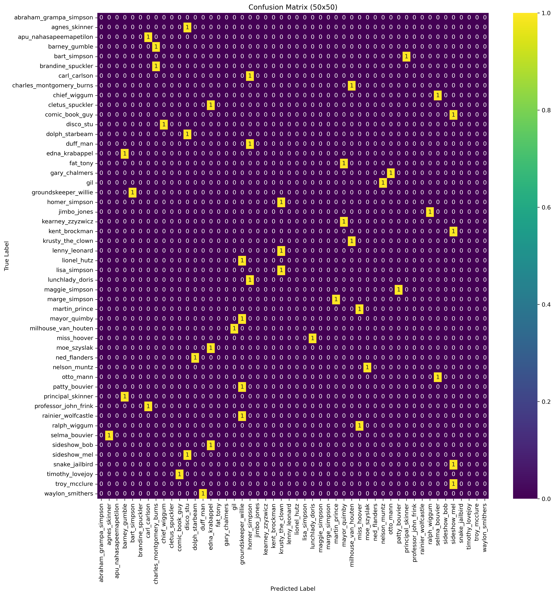

# 智能所-Machine Learning Lab2-辛普森角色 CNN模型辨識
## Author：國立陽明交通大學 資訊管理與財務金融學系財務金融所碩一 313707043 翁智宏

本次是機器學習第二次作業，訓練一個影像辨識模型，能夠辨識出 *The Simpsons* 動畫影集中 **50 位角色**。我們採用 **卷積神經網路 (Convolutional Neural Network, CNN)** 作為模型基礎，進行角色的影像辨識。

Kaggle Competition：[點擊這裡](https://www.kaggle.com/competitions/nycu-iaii-ml-2024-classification) 競賽連結

最終成績如下所示：


> 準確率在 0.86073 左右
---

## 目標角色 (Target Characters)

以下是數據集中包含的角色：

- abraham_grampa_simpson （阿伯拉罕·辛普森爺爺）  
- agnes_skinner （艾格尼斯·斯金納）  
- apu_nahasapeemapetilon （阿普）  
- barney_gumble （巴尼·岡博）  
- bart_simpson （巴特·辛普森）  
- brandine_spuckler （布蘭丁·斯帕克勒）  
- carl_carlson （卡爾·卡爾森）  
- charles_montgomery_burns （蒙哥馬利·伯恩斯先生）  
- chief_wiggum （維格姆警長）  
- cletus_spuckler （克萊圖斯·斯帕克勒）  
- comic_book_guy （漫畫書店老闆）  
- disco_stu （迪斯可·史都）  
- dolph_starbeam （道夫·斯塔比姆）  
- duff_man （達夫啤酒人）  
- edna_krabappel （艾德娜·克拉巴佩爾老師）  
- fat_tony （胖東尼）  
- gary_chalmers （加里·查莫斯）  
- gil （吉爾）  
- groundskeeper_willie （威利園丁）  
- homer_simpson （霍默·辛普森）  
...  
（其餘角色請參考完整清單）

---

## Images of 50 characters extracted from The Simpsons epsodes
- About 2000 images per character
- Pictures are under various size, scenes and distortions
- not necessarily centered in each image and could sometimes be with or cropped from other characters

---

## 安裝依賴

請使用以下指令安裝本專案所需的依賴套件：

```bash
!pip install torch 
!pip install torchvision   
!pip install timm
!pip install pandas
!pip install matplotlib
```

---
## 實作 (Task 1)

### 第一步：資料預處理
#### 1. 先定義資料增強的方法
```
import torch
from torchvision import datasets, transforms
import torchvision.transforms as transforms
from torch.utils.data import random_split, DataLoader

import os
import torchvision.transforms.v2 as T
from PIL import Image

# Custom transform to add Gaussian noise
class AddGaussianNoise(object):
    def __init__(self, mean=0., std=1.):
        self.std = std
        self.mean = mean

    def __call__(self, tensor):
        return tensor + torch.randn(tensor.size()) * self.std + self.mean

# Custom transform to add Speckle noise
class AddSpeckleNoise(object):
    """
    Add speckle noise to the image.
    """
    def __init__(self, noise_level=0.1):
        """
        :param noise_level: Standard deviation of the noise distribution
        """
        self.noise_level = noise_level

    def __call__(self, tensor):
        """
        :param tensor: PyTorch tensor, the image on which noise is added
        :return: PyTorch tensor, image with speckle noise
        """
        # Generate speckle noise
        noise = torch.randn_like(tensor) * self.noise_level

        # Add speckle noise to the image
        noisy_tensor = tensor * (1 + noise)

        # Clip the values to be between 0 and 1
        noisy_tensor = torch.clamp(noisy_tensor, 0, 1)

        return noisy_tensor

class AddPoissonNoise(object):
    """
    Add Poisson noise to the image.
    """
    def __init__(self, lam=1.0):
        """
        :param lam: Lambda parameter for Poisson distribution
        """
        self.lam = lam

    def __call__(self, tensor):
        """
        :param tensor: PyTorch tensor, the image to which noise is added
        :return: PyTorch tensor, image with Poisson noise
        """
        # Generate Poisson noise
        noise = torch.poisson(self.lam * torch.ones(tensor.shape))

        # Add Poisson noise to the image
        noisy_tensor = tensor + noise / 255.0  # Assuming the image is scaled between 0 and 1

        # Clip the values to be between 0 and 1
        noisy_tensor = torch.clamp(noisy_tensor, 0, 1)

        return noisy_tensor

# Custom transform to add Salt and Pepper noise
class AddSaltPepperNoise(object):
    def __init__(self, salt_prob=0.05, pepper_prob=0.05):
        self.salt_prob = salt_prob
        self.pepper_prob = pepper_prob

    def __call__(self, tensor):
        noise = torch.rand(tensor.size())
        tensor = tensor.clone()  # Clone the tensor to avoid modifying the original
        
        # Apply salt noise: setting some pixels to 1
        tensor[noise < self.salt_prob] = 1
        
        # Apply pepper noise: setting some pixels to 0
        tensor[noise > 1 - self.pepper_prob] = 0
        
        return tensor


# Define the image augmentation transformations
transform = T.Compose([
    T.Resize(256),                     # 調整圖像大小
    T.CenterCrop(224),                 # 中心裁剪至 224x224
    T.ToTensor(),                      # 轉換為 Tensor
    T.RandomHorizontalFlip(p=0.1),     # 水平翻轉
    T.RandomVerticalFlip(p=0.1),       # 垂直翻轉
    T.RandomRotation(10),              # 隨機旋轉
    T.ColorJitter(0.4, 0.4, 0.4, 0.1), # 色彩抖動
    T.RandomGrayscale(p=0.1),          # 灰階
    T.Normalize(mean=[0.485, 0.456, 0.406], std=[0.229, 0.224, 0.225]) # 正規化 (ViT 使用 ImageNet 的均值與標準差)
])
```

#### 2. 載入數據集，以及區隔出訓練集和驗證集
```
batch_size = 32

# 載入完整的訓練資料集
full_dataset = datasets.ImageFolder(root='./train/train', transform=transform)

# 設置拆分比例（例如 80% 用於訓練，20% 用於驗證）
train_size = int(0.8 * len(full_dataset))
val_size = len(full_dataset) - train_size

# 使用 random_split 進行拆分
train_dataset, val_dataset = random_split(full_dataset, [train_size, val_size])

# 建立 DataLoader
train_loader = DataLoader(train_dataset, batch_size=batch_size, shuffle=True, num_workers=2)
val_loader = DataLoader(val_dataset, batch_size=batch_size, shuffle=False, num_workers=2)

device = torch.device("cuda" if torch.cuda.is_available() else "cpu")

print(f"Training samples: {len(train_dataset)}")
print(f"Validation samples: {len(val_dataset)}")

# # 檢查資料集類別
class_names = full_dataset.classes
```

### 第二步：模型訓練
#### 1. 載入預訓練模型（VIT）
```
from torchvision.models import vit_b_16

# 使用 torchvision 提供的 ViT 模型
model = vit_b_16(pretrained=True).to(device)

# 替換分類頭
in_features = model.heads.head.in_features  # ViT 的輸出特徵數
num_classes = len(class_names)  # 類別數量
model.heads.head = nn.Sequential(
    nn.Linear(in_features, 256),  # 隱藏層
    nn.ReLU(inplace=True),
    nn.Linear(256, num_classes)   # 輸出層
).to(device)
```

#### 2. 設定優化器和loss function
```
import torch.optim as optim

# 定義損失函數和優化器
criterion = nn.CrossEntropyLoss()  # 分類任務中的標準損失函數
optimizer = optim.Adam(model.parameters(), lr=1e-3, weight_decay=5e-4) # good
```

#### 3. 訓練模型
```
num_epochs = 30  # 訓練的回合數
optimizer = torch.optim.Adam(model.parameters(), lr=1e-4)  # 假設使用 Adam 優化器
criterion = torch.nn.CrossEntropyLoss()  # 假設使用交叉熵損失

for epoch in range(num_epochs):
    model.train()  # 訓練模式
    running_loss = 0.0
    for inputs, labels in train_loader:
        # 確保圖像與標籤移動至正確的設備
        inputs, labels = inputs.to(device), labels.to(device)

        # 前向傳播與梯度更新
        optimizer.zero_grad()         
        outputs = model(inputs)    
        loss = criterion(outputs, labels)  
        loss.backward()                
        optimizer.step()               

        running_loss += loss.item()

    # 訓練損失輸出
    print(f"Epoch {epoch+1}/{num_epochs}, Training Loss: {running_loss/len(train_loader):.4f}")
```

#### 4. 驗證模型
```
model.eval()  # 設置模型為評估模式
correct = 0
total = 0
with torch.no_grad():  # 關閉梯度計算，以節省記憶體
    for inputs, labels in val_loader:
        inputs, labels = inputs.to(device), labels.to(device)
        outputs = model(inputs)
        # print(outputs)
        _, predicted = torch.max(outputs, 1)
        total += labels.size(0)
        correct += (predicted == labels).sum().item()

accuracy = 100 * correct / total
print(f'Validation Accuracy: {accuracy:.2f}%')
```

#### 5. 模型預測
```
# 定義圖像的轉換
transform = T.Compose([
    T.Resize(256),      # 調整圖像大小
    T.CenterCrop(224),  # 中心裁剪
    T.ToTensor(),       # 轉換為張量
    T.Normalize(mean=[0.485, 0.456, 0.406], std=[0.229, 0.224, 0.225])  # 正規化
])

# 自定義排序函數
def numeric_sort(img_list):
    return sorted(img_list, key=lambda x: int(os.path.splitext(os.path.basename(x[0]))[0]))

# 加載測試資料集
test_dataset = datasets.ImageFolder(root='./test-final', transform=transform)
test_dataset.samples = numeric_sort(test_dataset.samples)  # 按數值排序
test_dataset.imgs = test_dataset.samples  # 更新 imgs 以符合排序結果

# 建立測試 DataLoader
test_loader = DataLoader(test_dataset, batch_size=batch_size, shuffle=False, num_workers=2)

# 模型評估模式
model.eval()  
predictions = []  # 初始化預測結果

# 遍歷測試集並生成預測
with torch.no_grad():
    for i, (inputs, _) in enumerate(test_loader, start=1):  # start=1 表示 ID 從 1 開始
        inputs = inputs.to(device)
        outputs = model(inputs)  # 前向傳播
        _, predicted = torch.max(outputs, 1)  # 獲取每個樣本的預測類別索引

        # 保存 batch 中的預測結果
        for idx, pred in enumerate(predicted):
            class_name = class_names[pred.item()]  # 根據索引獲取類別名稱
            predictions.append({'id': (i - 1) * batch_size + idx + 1, 'character': class_name})  # 計算全域 ID

# 保存提交檔案
submission_df = pd.DataFrame(predictions)
submission_df.to_csv('submission-new.csv', index=False)
print("Submission file 'submission-new.csv' generated successfully!")
```
---

## Task 2 Compute the Confusion Matrix (50x50)


---
## Task3 Visualization and Understanding  Convoutional Neural Networks
### 圖片在 Task3 folder 中


